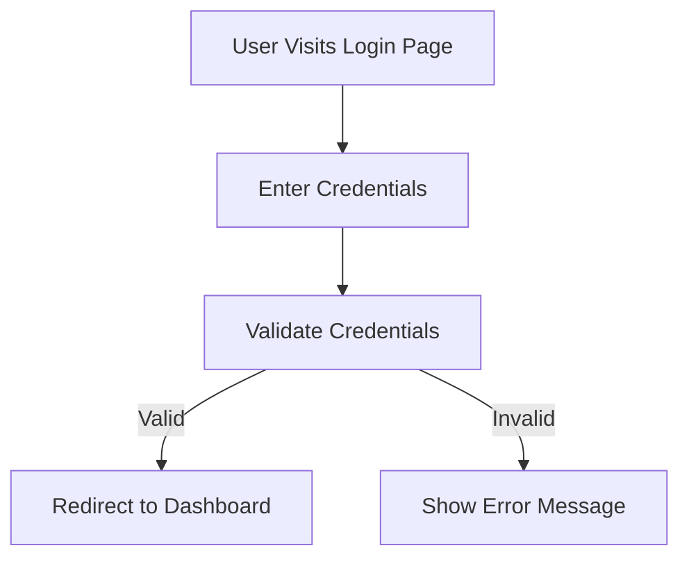
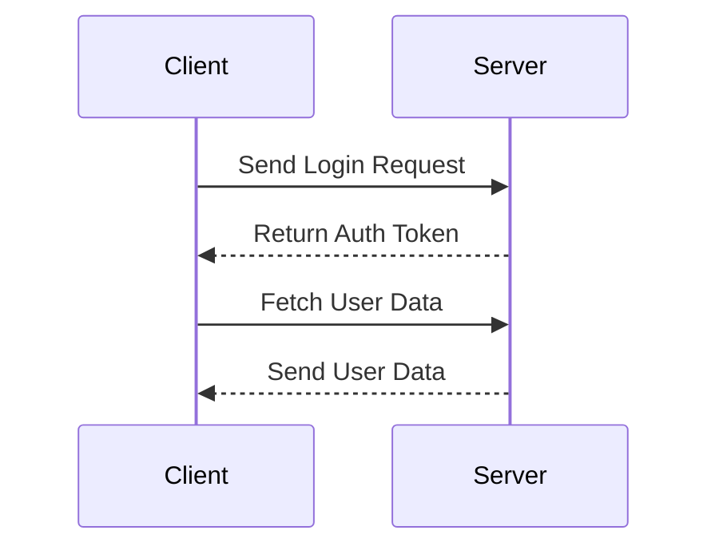
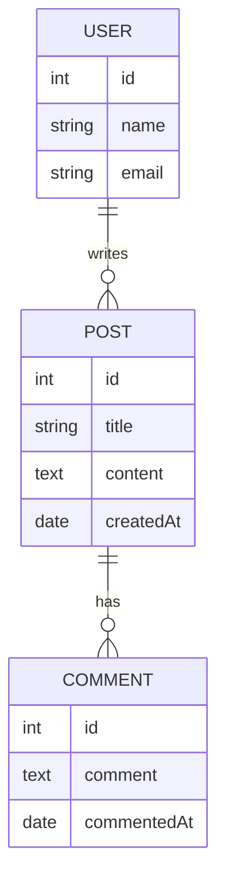

# Simplify code documentation & explanations with Mermaid

> Author: [Eazie Enibe](eae@alteos.com)  
> Date: 21.11.2024

## 1. Introduction
Hello everyone,

Today, I’m excited to introduce you to a powerful tool that simplifies and enhances the way we document and explain our code: Mermaid.live.

Mermaid is a JavaScript-based diagramming and charting tool that allows you to create visual representations directly from text. The Mermaid.live platform lets you try out your ideas, render diagrams in real time, and export them for use in your projects.

### Why Use Mermaid.live?

* **Improves Code Understanding**: Makes complex systems or workflows easier to understand.
* **Saves Time**: No need for external diagramming tools like Visio or Lucidchart.
* **Integration Ready**: The generated .md or .mdx files can seamlessly integrate into your documentation in IDEs like VS Code and WebStorm.

## 2. Description

Mermaid supports several types of diagrams, making it suitable for various scenarios in code documentation. Some of its key diagram types include:

### Key Diagram Types
1. **Flowcharts**: Represent processes, workflows, or algorithms.
2. **Sequence Diagrams**: Model interactions between system components.
3. **Class Diagrams**: Document object-oriented systems.
4. **State Diagrams**: Visualize state transitions.
5. **Gantt Charts**: Track project timelines.
6. **Entity-Relationship Diagrams (ERDs)**: Design databases visually.

Each diagram is written using an easy-to-learn syntax and rendered into professional visuals.

## 3. Examples

## Case Study: Documenting a User Authentication Flow

**Scenario**: Let’s say we’re documenting the flow of user authentication for a web application.

**Step 1**: Open Mermaid.live.

**Step 2**: Enter the following text in the left editor pane:

`auth-flow.mdx`

**Step 3**: Mermaid.live will render the following diagram:

### Using the Diagram in Your Documentation

#### Copying as Markdown
* In Mermaid.live, click the "Export" option.
* Choose Markdown or MDX and copy the code.

#### Integration into VS Code
* Create a new .md file in your project.
* Paste the exported Mermaid code into the file.
* Use a Markdown Preview plugin to render diagrams directly in VS Code.

#### Integration into WebStorm
* Paste the markdown code into documentation files.
* Enable Markdown rendering in WebStorm settings for a seamless experience.

### Additional Examples

#### Example 1: Sequence Diagram for API Calls

`api-call-flow.mdx`

#### Example 2: ER Diagram for a Blogging Platform

`blogging-er-diagram.mdx`

## 3. References

### Key Resources

* Mermaid Documentation [link](https://mermaid.js.org/intro/getting-started.html "Mermaid Documentation")
* Mermaid Live Editor [link](https://mermaid.live/ "Mermaid.live Editor")
* Markdown Plugins for VS Code [link](https://marketplace.visualstudio.com/items?itemName=DavidAnson.vscode-markdownlint  "Markdown Plugins for VS Code")
* WebStorm Markdown Guide [link](https://www.jetbrains.com/help/webstorm/markdown.html#diagrams "WebStorm Markdown Guide")
